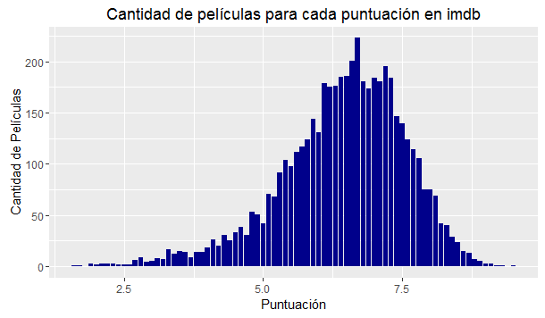
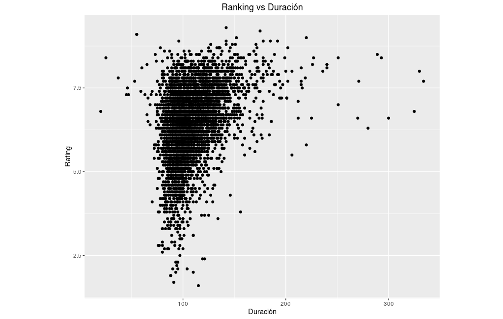
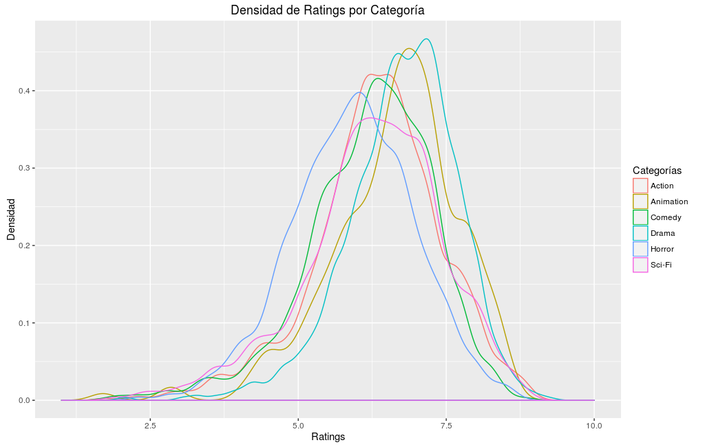
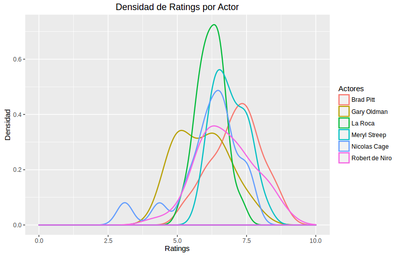
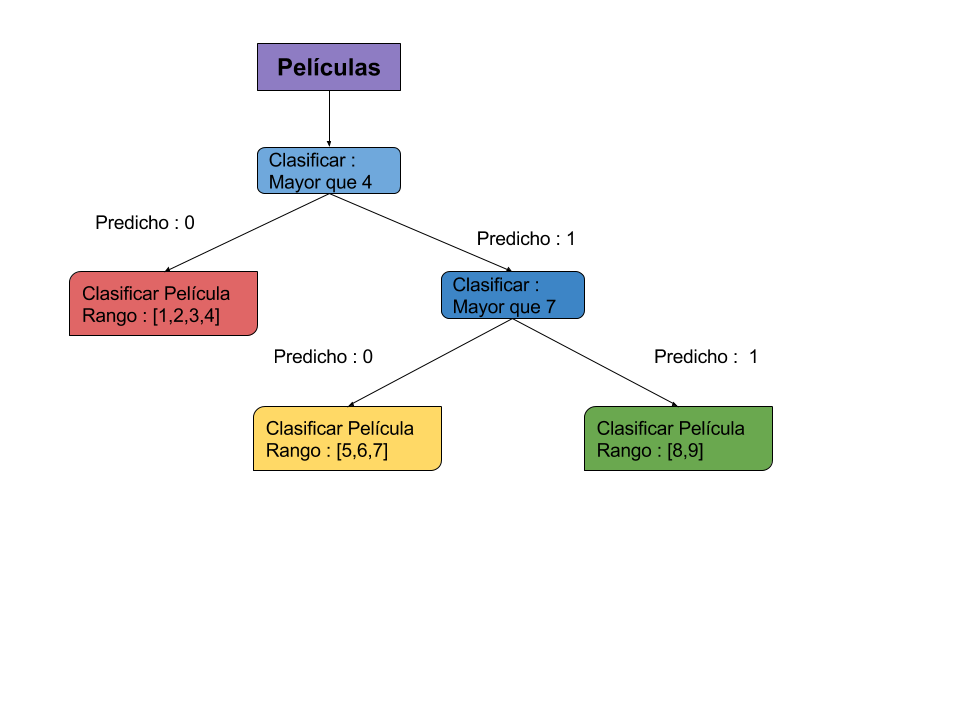

#Proyecto Minería de Datos: Predicción de Calificaciones de Películas

**Integrantes**: Pablo Badilla, Rodrigo Hernández, Martín Panza

### Descripción del Problema

#### Motivación 
En internet existen diversas alternativas para que las personas expongan sus
opiniones sobre algo. Libros, música, videojuegos, y en particular, películas. Páginas
web como IMDB y MovieLens registran las opiniones de cientos de usuarios día a
día, dispuestos a manifestar lo que piensan acerca de una película que acaban de
ver. De esta forma, pueden darle una "nota" al film y así cada película queda
posicionada según el promedio de sus notas. Sabiendo esto, puede llegar a ser
interesante intentar saber en qué casos una película se considera buena o no, e
intentar saber si contar con un actor como Robert De Niro en el reparto de una
nueva película afectará en el desempeño de ésta en las calificaciones de los
usuarios.
Esta información podría serles útil a las productoras de películas que tienen que decidir qué reparto contratar para sus películas con el objetivo de obtener la nota más alta posible, y de esta forma asegurar el éxito en sus producciones. 


#### Problema a resolver

El gran problema que debemos resolver entonces, es cómo utilizar una gran cantidad de metadatos de peliculas (entre los que se encuentran los actores principales, director, género, etc) para así predecir la calificación o score que los usuarios le darían a alguna película que vaya a ser estrenada. Es decir, utilizando meta-datos conocidos de películas anteriores se asociarán las calificaciones de alguna manera a sus participantes y de esta forma al probar con diferentes combinaciones para películas nuevas, obtener diferentes notas y así elegir la mejor.


###Descripción de los datos

Se utilizan dos datasets de metadatos de películas encontrados en la red:

1. IMDb: Originalmente de un contest de la pagina [Kaggle](https://www.kaggle.com/deepmatrix/imdb-5000-movie-dataset) que trataba sobre algo similar a lo que se desea realizar en este proyecto, pero utilizando la cantidad de caras en el póster de la película. Éste contenía variados atributos relacionados con cada película:
	* Nombre de la película
	* 3 columnas de actores principales
	* Director
	* Duración
	* Número de caras en la portada
	* Año de estreno
	* Presupuesto
	* Ganancias
	* Links a Imbd
	* Facebook likes y otros.
	* Aspect Ratio
	
2. Movielens: Es un dataset masivo original de [Grouplens](http://grouplens.org), el que al igual que el dataset anterior, contiene una gran colección de datos pero generados por usuarios. Éste contenía 4 archivos, los que estaban compuestos por:
	* Movies.csv:
		* MovieId
		* Nombre de la pelicula
		* Generos (entre 1 a 3 generos escritos en un mismo string)
	* Links.csv:
		* Movieid
		* Link a IMBD
	* Tags.csv:
		* MovieId
		* Tag
	* Rating: 
		* MovieId
		* Rating
		
Ambos datasets contienen datos sobre variadas películas que datan del 1916 o incluso cortometrajes del siglo XIX, hasta películas de la actualidad (2016). El primer dataset de Kaggle cuenta con 5043 registros de películas almacenados en un archivo con 28 atributos. El otro set de datos perteneciente a MovieLens contiene 34208 registros de
películas. Cada película tiene asociada un id propio del dataset junto a su id en
IMDB e id en the movie database. Además cada película
puede tener asociados varios géneros, tags y ratings. Tanto tags como ratings son
registrados por usuarios, por lo que a su vez contienen el id del usuario y el tiempo
en que se hizo el registro. El número de registros es 586994 para tags y 22884377
para ratings. El dataset de Kaggle posee atributos con algunos datos faltantes (NA). Sin
embargo, para cada atributo, este número no sobrepasa los 50 registros. A
excepción de los atributos que tienen que ver con temas monetarios; es decir,
presupuesto y recaudación, que alcanzan 800 NA's. A su vez, MovieLens solo posee
datos faltantes en el id de the movie database (296).
		
### Limpieza de los datos

#### Exploracion Inicial Preliminar
En un comienzo solo se exploraron los datos, intentando encontrar relaciones entre los metadatos mostrados en la sección anterior y cómo pueden estos afectar en las notas de las películas. Todo esto con el fin de armar un primer modelo.
Los archivos se encuentran en formato .csv por lo que fue directo
importarlos a RStudio, herramienta con la que se realizó la exploración inicial. Ya
que en ambos datasets se tienen atributos propios importantes, en gran parte de la
exploración inicial se trabajó con la intersección de ambas. Es decir, se utilizó un
join entre ambas para tener la máxima cantidad de atributos para cada película.
Para llevar a cabo esta operación se requirió de un atributo en común. El dataset
de MovieLens posee un atributo Id en Imdb, que sin embargo, Kaggle no tiene. No
obstante, Kaggle tiene el link de la página web de cada película en Imdb, que a su
vez contiene el id dentro. A partir de la expresión regular [0-9]* se obtuvieron los
dígitos incluidos en el link, que corresponden al valor buscado. Haciendo posible la
intersección. Sin embargo, se perdieron ciertos registros que redujeron el total a
4566. Por último, se encontraron datos repetidos, por lo que fue necesario filtrar
para dejar sólo datos únicos según la llave 'id de imdb', resultando en 4452
registros efectivos para la intersección. Por otro lado, en MovieLens, el año se
encontraba dentro del string del título de la película. Ejemplo: Toy Story (1995); por
lo que también debió extraerse mediante expresiones regulares para utilizarlo
como un atributo.


Algunos ejemplos de la exploracion inicial:

#### Cantidad Total de Películas para cada calificación en IMDB



La primera pregunta que se planteó fue cómo se distribuían las calificaciones
de las películas en el dataset, por lo que se realizó una agrupación por cada
evaluación diferente y se graficó la cantidad de películas para cada una de ellas
utilizando barras. La distribución se comporta como uno esperaría que lo hiciera, aproximándose a una normal.

#### Score vs Duracion



Se puede ver en este grafico que tanto las películas que tienen una duracion mayor que 130 minutos tienden a tener notas sobre 5.5 mientras que las que duran menos de 80 minutos (probablemente cortos) tienden a tener notas superiores a 6.5. Por otro lado, el intervalo entre 80 y 130 minutos no otorga información concluyente por si mismo, ya que es ahi donde se encuentra una gran cantidad de películas con todo tipo de score. 

#### Score vs genero de la película



Se puede ver en este gráfico que cada categoría de peliculas tiende a tener una función de distribución normal, cada una centrada en un promedio distinto. Sobre esta base, se puede suponer que ciertos tipos de categorías determinarán en alguna medida los scores de las películas a las que pertenezcan. En este caso se tiene por ejemplo que las películas de drama por lo general tienden a tener una mejor evaluacion por parte de los usuarios con respecto a otras películas de distintas categorías.

#### Score vs actores



Tal como vimos en el gráfico anterior, tambien se puede inferir que existe una relación entre el actor que esta presente en la película y su score. Esto se puede ver por ejemplo con actores como Brad Pitt que tiene la mayoría de sus películas más o menos bien distribuidas en el intervalo 8-9 mientras que "La Roca" tiene practicamente todas sus películas en el 6.


#### Limpieza

Luego de haber realizado la exploración inicial de los datos, se tomó la
decisión de eliminar algunos atributos por diversos motivos. Algunos fueron
removidos debido a que no concordaban con el objetivo del proyecto. La
recaudación por ejemplo, está fuera de nuestros intereses pues es información
posterior a la evaluación de la película que nosotros buscamos conocer
previamente. En este mismo sentido también eliminamos el número de ratings y
reviews. También el número de likes en facebook de directores, actores y la
película considerando además que requieren de una actualización constante para
poder utilizarlos correctamente. Por otro lado, el atributo rating de contenido
contenía demasiados datos faltantes por lo que se debió remover. Finalmente el
atributo color que indicaba si la película se encontraba en blanco y negro poseía
datos erróneos que se podían notar con facilidad y tampoco fue considerada.
Así, los atributos que se consideraron para el clasificador finalmente fueron:
género, director, actores, duración, puntuación.
Algunos atributos múltiples como género, se encontraban en una sola
columna con un delimitador (género: Acción | Drama | Comedia). Por lo que se
separó en columnas de acuerdo a los requerimientos mencionados en la sección de
"Pre-Procesamiento de Datos."
Por último, los requerimientos mencionados también en aquella sección,
indicaron que la dimensión que resultaría de la cantidad de actores (alrededor de
10000), junto con la cantidad de directores (alrededor de 5000) sería muy alta. Por
lo que se debió hacer una reducción de la dimensionalidad para estos dos
atributos. Respecto a los actores, bajo la consideración de que son más relevantes
para el análisis aquellos que se encuentran en más películas y trabajan con otros
actores, se construyó un grafo en el cual cada nodo corresponde a un actor
diferente y cada enlace entre dos actores consideraba que hubiesen trabajado
juntos en alguna película. De esta forma, se pudo probar dos algoritmos que
asignaran una importancia a cada actor de acuerdo a sus enlaces: el algoritmo
Eigenvector Centrality y una variante similar de éste, PageRank de Google. Ambos
algoritmos arrojaron una lista con la importancia de cada nodo en el grafo. Así, fue
fácil determinar con cuántos actores se trabajaría y cortar la lista de forma de
reducir la cantidad de actores según su importancia. Con los directores no era
posible encontrar el mismo grafo dado que sólo había uno por cada película. Por lo
tanto, utilizando el mismo criterio que para los actores, se filtraron a todos los
directores que hubiesen trabajado en menos de una cantidad determinada de
películas. Finalmente, se dejaron aproximadamente 500 actores y 500 directores
que corresponden a los más "influyentes" (esto se traduce a que tuvieron más
participaciones) y se usó el método de Eigan para el grafo.

### Procesamiento de Datos


#### Pre-Procesamiento (Prueba Preliminar)

Para cumplir con el objetivo del proyecto, se determinó que un clasificador
sería nuestra herramienta a utilizar. Así, se estudió el clasificador proporcionado
por la librería Scikit-Learn. Esto nos indicó los cambios que requerían los datos para
poder utilizarlo de forma correcta.
En primer lugar, el clasificador no recibe ninguna clase de null/NA, por lo
que fue necesario eliminar las filas que los contuviesen en alguna de sus columnas.
De todas formas, no eran tantos NA por lo que se podría hacer una búsqueda para
rellenar esos campos que faltaron, si es necesario.
En segundo lugar, el clasificador sólo recibe atributos numéricos. Siendo que
la mayoría de nuestros atributos consisten de Strings (Director, Actor, Género,
etc.), fue necesario transformarlos para ser recibidos por el clasificador. Esto se
llevó a cabo añadiendo columnas de acuerdo a cada String diferente en un
atributo. Es decir, haciendo una matriz booleana (0 y 1) indicando si el registro (id
de la película) poseía el string indicado en la columna o no. Por ejemplo, una
película que tuviese género horror y drama, marcaría un 1 en las columnas "terror"
y "drama" y un 0 en los demás géneros. Es por esta razón que debió realizarse una
reducción de dimensionalidad para actores y directores mencionada en la sección
anterior. Este trabajo tomó mucho tiempo y concentró muchos de los esfuerzos del trabajo en general.


#### Resultados Preliminares
En la prueba preliminar, el clasificador que obtuvo mejores resultados fue Support Vector Machine, obteniendo un Accuracy de 0.39. Este resultado no se considera aceptable de acuerdo al objetivo, por lo que se propuso mejorar el clasificador para obtener mejores resultados. También se concluyó en esta prueba que el clasificador falla en algunos casos de películas con pocos datos de respaldo, como por ejemplo "Justin Bieber: Never Say Never", en la que erró por mucho la nota.


### Re-Procesamiento


#### Árbol Cualitativo
Observando los resultados con varios clasificadores convencionales, se llegó a la conclusión de que era mejor crear un clasificador que considerara cierto tipo de "orden" en los datos, tratando de evaluar no sólo la categoría de las películas, si no que también si éstas entran en ciertas calificaciones cualitativas como por ejemplo: muy mala, mala, regular, buena y muy buena.

Para esto la idea principal es construir un árbol de clasificadores, en donde cada nodo sea un clasificador que trate de brindarle sentido a lo que está clasificando y cada hoja sea finalmente el clasificador que determine la nota de la película.

Esto se basa en la hipótesis de que si se entrenan los clasificadores de las hojas, éstos tendrán datos muy similares y con cantidades parecidas de datos. Esto les permitirá predecir con más exactitud y por otro lado, los clasificadores de los nodos solo deben clasificar dos clases: tiene una cualidad o no la tiene. Esto permite predecir de mejor manera los datos.


#### Implementación
Se trata de asignarle sentido a lo que se está clasificando a través de varios clasificadores ordenados en un árbol. Se usa Regresión Logística y Support Vector Machines Lineales. El árbol queda algo así:



#### Definiciones Anteriores
```python
#Funciones Genericas:

#Carga un archivo con scores
def load_archive(name):
    archive = pd.read_csv(name, header = 0)
    archive = np.ravel(archive.as_matrix())
    return archive

#Carga un archivo con meta-datos
def load_text_archive(name):
    movies = pd.read_csv(name, header = 0)
    movies_header = list(movies.columns.values)
    movies = movies.as_matrix()
    return movies

#Entrena a los clasificadores usando los dataset correspondientes.
def train_trees(classifiersTree, movies, score_datasets,size = 0.30):
    trained_classifiersTree = []
    scores = []
    
    for i in range(len(classifiersTree)):
        X_train, X_test, y_train, y_test = train_test_split(movies_datasets[i], scores_datasets[i], test_size = size)
        classifiersTree[i].fit(X_train, y_train)
        trained_classifiersTree.append(classifiersTree[i])
        scores.append(classifiersTree[i].score(X_test, y_test))
    return (trained_classifiersTree,scores)
```

#### Implementación del árbol

Se crean los clasificadores y se cargan los archivos contenedores de películas y scores para cada clasificador:

```python
#Definiciones Previas

#Crea un array de clasificadores.
def create_clf_array(clf_type):
    clf_cmp4 = clf_type() # 0 si es menor que 4, 1 de lo contrario.
    clf_1to4 = clf_type() # Clasifica en un rango de notas de 1 a 4.
    clf_cmp7 = clf_type() # 0 si es menor que 7, 1 de lo contrario
    clf_5to7 = clf_type() # Clasifica de 4 a 7. 
    clf_8to10= clf_type() # Clasifica de 8 a 10.
    return [clf_cmp4,clf_1to4,clf_cmp7,clf_5to7,clf_8to10 ]  


#Cargamos los archivosn de cada clasificador respectivo en varios arrays.

movies_0to4 = load_text_archive("movies_0to4.csv")
movies_5to7 = load_text_archive("movies_5to7.csv")
movies_8to10 = load_text_archive("movies_8to10.csv")

scores_cmp4 = load_archive("scores_cmp4.csv")
scores_0to4 = load_archive("scores_0to4.csv")
scores_cmp7 = load_archive("scores_cmp7.csv")
scores_5to7 = load_archive("scores_5to7.csv")
scores_8to10 =load_archive("scores_8to10.csv")

#Arrays Listos para ser usados.


logisticClfTree = create_clf_array(LogisticRegression)
SvmClfTree = create_clf_array(SVC)

movies_datasets = [movies, movies_0to4, movies,movies_5to7,movies_8to10]
scores_datasets = [scores_cmp4, scores_0to4, scores_cmp7 ,scores_5to7,scores_8to10]
```

#### Definición del árbol

Se define a través de una función condicional que emula al árbol:

```python
# Definimos el arbol en esta funcion. Ver imagen del arbol!

def predict_with_clfTree(classifiersTree,value_to_predict):
    #Clasifico si la nota es mayor o menor que 4.
    if (classifiersTree[0].predict(value_to_predict)):
        #Clasifico si la nota es mayor o menor que 7
        if (classifiersTree[2].predict(value_to_predict)):
            return classifiersTree[4].predict(value_to_predict)
            #Si es menor clasifico 
        else:
            return classifiersTree[3].predict(value_to_predict)
        
    #Si es menor que 4: 
    else:
        return classifiersTree[1].predict(value_to_predict)

    
    
# Definimos Classification report para el arbol

def classification_report_with_tree(classifiersTree,movies,scores):
    scores_predicted = []
    for i in range(len(movies)):
        scores_predicted.append(predict_with_clfTree(classifiersTree,movies[i].reshape(1, -1))[0])
    return accuracy_score(scores,scores_predicted),classification_report(scores,scores_predicted)
```

#### Se prueba el árbol

```python
#A ver que tal funciona! 

#Test set : 0.30

#Entrenamos los arboles!
logisticClfTree = train_trees(logisticClfTree,movies_datasets,scores_datasets)
SvmClfTree =train_trees(SvmClfTree,movies_datasets,scores_datasets)


#Predecimos y imprimimos...

logistic_reports = classification_report_with_tree(logisticClfTree[0],movies,scores)
svm_report = classification_report_with_tree(SvmClfTree[0],movies,scores,0.20)
```

#### Test Set de 30%

```python
#Imprimir!
def print_report(report,name,scores):
    print name + "\n\nAccuracy:"
    print report[0] 
    print "Individual Accuracy:"
    print scores
    print "\nReport:"
    print report[1]
    print "\n"
    
print_report(logistic_reports,"Logit",logisticClfTree[1])
print_report(svm_report,"SVM",SvmClfTree[1])
```


#### Resultados Finales para el Árbol

Esto arroja el siguiente resultado:

####Logit

| Accuracy        |
| --------------- |
| 0.728436657682   | 


Report: | precision | recall | f1-score | support
--- | --- | --- | --- | ---
2 | 1.00 | 0.50 | 0.67 | 16
3 | 0.63 | 0.30 | 0.41 | 40
4 | 0.70 | 0.39 | 0.50 | 171
5 | 0.71 | 0.47 | 0.56 | 478
6 | 0.66 | 0.84 | 0.74 | 1487
7 | 0.80 | 0.76 | 0.78 | 1497
8 | 0.84 | 0.72 | 0.77 | 728
9 | 0.45 | 0.80 | 0.58 | 35
**avg/total** | **0.74** | **0.73** | **0.72** | **4452**


####SVM

| Accuracy        |
| --------------- |
| 0.803009883199   |

Report: | precision | recall | f1-score | support
--- | --- | --- | --- | ---
2 | 1.00 | 0.44 | 0.61 | 16
3 | 1.00 | 0.28 | 0.43 | 40
4 | 0.92 | 0.52 | 0.66 | 171
5 | 1.00 | 0.60 | 0.75 | 478
6 | 0.78 | 0.84 | 0.81 | 1487
7 | 0.73 | 0.92 | 0.81 | 1497
8 | 0.99 | 0.74 | 0.85 | 728
9 | 1.00 | 0.54 | 0.70 | 35
**avg/total** | **0.83** | **0.80** | **0.80** | **4452**

####Árbol Clasificador: Ventajas

1. Permite clasificar bien clases sub-representadas:
	* Clases 2, 3, 4
	* Clases 8, 9

2. Alta precisión, sobre todo en SVM

3. Ya que cada nodo es un clasificador, cada uno puede optimizarse de forma independiente con tal que se ajuste a su propio dataset.

####Árbol Clasificador: Desventajas

1. Mayor tiempo de entrenamiento: Es proporcional al número de nodos del árbol

2. En este caso, no clasifica tan bien las clases más representadas: 5-6-7. Esto se debe a que ahí hay una gran cantidad de datos muy similares.

###Conclusiones
Durante el desarrollo del proyecto se ha adquirido conocimiento sobre el proceso de analizar un dataset desde el principio. Se aprendió que una gran parte del tiempo y esfuerzo total del proyecto se concentra en limpiar y ordenar los datasets con los que se trabaja puesto que muy probablemente el estado en el que se obtiene no es el más óptimo para analizarlo. Se puede observar que dependiendo del problema a analizar, pueden haber mejores técnicas para cada caso. En el caso de este proyecto, se logró obtener resultados bastante satisfactorios aplicando el clasificador del árbol, pero se debe notar que se legó a esa solución tras haber pasado por muchos intentos de clasificadores que fallaban rotundamente. Es decir, es muy importante analizar cada problema distinto a fondo para así idear una solución adecuada para cada caso.
Finalmente, se logró obtener valores de Accuracy satisfactorios que permiten concluir que sí se puede predecir (aunque no con un 100% de precisión) la calificación de una película sabiendo el director, los actores principales, el género, la duración y algunos "tags" relacionados a la película.